<h1 align="center">
  &nbsp;OpenCraft Skills
</h1>

<p align="center">
  Portable Agent Skills + reusable Living Context for AI-assisted product development — the building-block implementation of <strong>Living Context Driven Development (LCDD)</strong>.
</p>

<p align="center">
  <a href="https://www.npmjs.com/package/opencraft-skills"></a>
  <a href="https://github.com/Lelianto/opencraft-skills/actions/workflows/quality.yml"></a>
  <a href="LICENSE"></a>
  <a href="skills"></a>
  <a href="packs"></a>
</p>

**Code evolves. Knowledge decays. AI never notices. Until now.**

Documentation dies. Specifications drift. Conventions are rewritten in every project. Yet AI agents keep coding as if nothing happened. OpenCraft fixes both sides of the problem:

- **Portable Agent Skills** give compatible AI agents (Claude Code, OpenAI Codex, Cursor, GitHub Copilot, and more) a shared, production-minded delivery system — from product analysis to authorized deployment.
- **Context Packs** install production-ready Living Context — conventions, security rules, testing strategy, AI coding rules — instead of rewriting project knowledge repeatedly.

Context Packs are the **building-block implementation** of the methodology defined at:

> **[github.com/Lelianto/living-context-driven-development](https://github.com/Lelianto/living-context-driven-development)**

## Table of Contents

- [■ What is OpenCraft Skills?](#what-is-opencraft-skills)
- [▶ The Problem](#the-problem)
- [◈ The OpenCraft Way](#the-opencraft-way)
- [◆ Layer 1 — Portable Agent Skills](#layer-1--portable-agent-skills)
- [◇ Layer 2 — Context Packs (the LCDD Building Block)](#layer-2--context-packs-the-lcdd-building-block)
- [☰ Quick Start](#quick-start)
- [▤ CLI Reference](#cli-reference)
- [↻ Installation Targets](#installation-targets)
- [☗ Human-in-the-Loop Decisions](#human-in-the-loop-decisions)
- [⊞ Delivery Lifecycle](#delivery-lifecycle)
- [☁ Persistent Project Artifacts](#persistent-project-artifacts)
- [⇔ Security and Provenance](#security-and-provenance)
- [◈ Repository Map](#repository-map)
- [※ Comparison with Related Approaches](#comparison-with-related-approaches)
- [✎ Core Philosophy](#core-philosophy)
- [☗ Roadmap](#roadmap)
- [♥ Contributing](#contributing)
- [✉ Acknowledgements](#acknowledgements)
- [⚖ License](#license)

---

## What is OpenCraft Skills?

OpenCraft gives Claude Code, OpenAI Codex, Cursor, GitHub Copilot, and other Agent Skills-compatible tools a shared delivery system for product development. It guides an agent from product evidence and PRD creation through experience design, architecture, implementation, testing, security, data validation, and deployment readiness — then keeps the project's **Living Context** versioned, enforced, and current.

The goal is not to generate more documents. The goal is to keep product intent, implementation decisions, verification evidence, and release safety aligned throughout delivery — and to make the project knowledge an AI agent codes against the same knowledge every human sees.

## The Problem

Your codebase has Technical Debt. Your knowledge base has **Context Debt**. The Postgres version you document is not the one you run. The regulation you cite was amended last month. The architectural pattern you enforce is the one you decided to replace two sprints ago. Nobody measures this debt. Nobody pays it down.

And AI agents make it worse. They optimize for "all tests pass." When context is absent or outdated, they fill the gap — rewriting tests, relaxing schemas, removing validation. The specification silently drifts to match the code, not the other way around.

LCDD names this precisely and treats **context as a first-class artifact** — versioned, governed, enforced, and evolved. OpenCraft is the building block that makes that context *reusable and installable*:

- Every **rule and convention** is structured, machine-readable, and enforceable.
- Every **rule** carries provenance, authority, ownership, and a lifecycle.
- Project knowledge is **shared as packs** instead of rewritten per project.

## The OpenCraft Way

The same values that animate LCDD animate OpenCraft:

1. **Living Evolution over Static Documentation** — rules are tested daily and deliberately evolved, never written once and forgotten.
2. **Explicit Governance over Implicit Trust** — every context answers: who says this is a rule, why, and who can change it.
3. **Machine-Readable over Human-Only** — if an AI agent cannot consume a rule, it will be ignored at scale.
4. **Evidence over Claims** — completion claims require fresh command output; facts, assumptions, decisions, and risks stay distinguishable.
5. **Human Authority** — production, destructive, and material decisions remain under human control; AI recommendations never count as approval.
6. **Reusable over Rewritten** — generic project knowledge should be installed, versioned, and shared — not re-authored per project.

## Layer 1 — Portable Agent Skills

A skill is a small, composable, portable instruction set (`SKILL.md`) that produces or verifies one meaningful outcome. Skills avoid prescribing frameworks and adapt to the repository's own conventions.

### Discover and specify

| Skill | Purpose |
|---|---|
| [`analyze-product`](skills/analyze-product) | Evaluate the problem, users, evidence, alternatives, opportunity, feasibility, and measurable outcomes. |
| [`shape-product`](skills/shape-product) | Reduce broad ideas into a coherent MVP slice, acceptance criteria, risks, and explicit non-goals. |
| [`write-product-prd`](skills/write-product-prd) | Produce a build-ready PRD with stable requirement IDs, journeys, quality constraints, metrics, and rollout expectations. |
| [`facilitate-product-decision`](skills/facilitate-product-decision) | Present material choices with evidence, trade-offs, a recommendation, and a durable decision record under explicit human authority. |

### Design the solution

| Skill | Purpose |
|---|---|
| [`design-product-experience`](skills/design-product-experience) | Define information architecture, flows, interaction states, responsive behavior, and accessibility. |
| [`craft-distinctive-product`](skills/craft-distinctive-product) | Ground design in meaning and originality; reject AI-slop patterns; create app-quality mobile experiences. |
| [`design-web-system`](skills/design-web-system) | Design boundaries, contracts, persistence, identity, migrations, reliability, and observability. |
| [`threat-model-platform`](skills/threat-model-platform) | Model assets, trust boundaries, abuse cases, threats, versioned controls, verification, and residual risk. |

### Plan and build

| Skill | Purpose |
|---|---|
| [`plan-product-delivery`](skills/plan-product-delivery) | Convert approved artifacts into traceable vertical slices, bounded tasks, dependencies, and readiness evidence. |
| [`execute-product-task`](skills/execute-product-task) | Execute one bounded task while preserving scope, traceability, and fresh verification evidence. |
| [`develop-with-tests`](skills/develop-with-tests) | Implement behavior through a risk-proportional red-green-refactor loop. |
| [`build-web-feature`](skills/build-web-feature) | Build production-shaped web platforms and full-stack vertical slices with responsive, accessible interfaces. |
| [`debug-platform`](skills/debug-platform) | Reproduce failures, test falsifiable hypotheses, identify root causes, and add regression evidence before fixing. |

### Review, test, and release

| Skill | Purpose |
|---|---|
| [`review-product-change`](skills/review-product-change) | Review specification compliance first, then correctness, security, data safety, accessibility, and maintainability. |
| [`test-platform`](skills/test-platform) | Execute risk-based E2E, multi-role, responsive, accessibility, security, privacy, and data-integrity testing. |
| [`verify-web-product`](skills/verify-web-product) | Perform an independent release-quality pass with explicit pass, fail, not-run, and residual-risk evidence. |
| [`prepare-deployment`](skills/prepare-deployment) | Prepare artifacts, configuration, migrations, observability, rollout, smoke tests, abort thresholds, and rollback. |
| [`ship-web-product`](skills/ship-web-product) | Orchestrate the complete lifecycle with proportional artifacts and authorization gates. |

## Layer 2 — Context Packs (the LCDD Building Block)

A **Context Pack** is a versioned, distributable bundle of Living Context — the composability layer of LCDD. Instead of rewriting project knowledge, declare it:

```yaml
# packs.yaml  (project root)
extends:
  - nextjs-pack
  - security-pack
  - fintech-pack
```

`opencraft packs install` resolves the pack graph (SemVer, cycles, diamonds), merges it by deterministic precedence, validates every context, and materializes an **LCDD Context Registry** into `.lcdd/`:

```text
.lcdd/
├── contexts/           # LCDD Context records (machine-readable governance)
├── project/            # merged Project Knowledge (vision, stack, conventions, …)
├── ai/AGENTS.md        # merged AI coding rules
├── CONTEXT.md          # generated living-context summary for agents
├── packs.lock.json     # resolved versions + integrity hashes
└── report.json         # merge/conflict/override audit
```

Each pack automatically provides the fourteen Living-Context concerns: project vision, architecture decisions, coding conventions, folder structure, technology stack, security rules, testing strategy, business constraints, AI coding rules, code review checklist, deployment guidelines, observability practices, lifecycle metadata, and ownership metadata.

The 14 reference packs ship with the repository:

| Type | Packs |
|---|---|
| baseline | `core-pack` (applied automatically on install) |
| technology | `typescript-pack`, `node-pack` |
| framework | `react-pack`, `nextjs-pack` |
| baas | `supabase-pack`, `firebase-pack` |
| cross-cutting | `security-pack`, `testing-pack`, `accessibility-pack` |
| domain | `fintech-pack`, `healthcare-pack`, `ecommerce-pack`, `education-pack` |

**Zero dependencies to run:** no API keys, no cloud account, and no `@lcdd/cli` prerequisite — though the materialized `.lcdd/` is fully interoperable with `@lcdd/cli` and `@lcdd/mcp` for teams that adopt them.

### LCDD applies automatically

Installing with `--with-project-files` (or running `opencraft-packs packs bootstrap`) **applies LCDD to the project automatically**: it creates `packs.yaml` with the baseline `core-pack` and materializes `.lcdd/` — a real Context Registry with enforced baseline contexts (evidence standard, secrets protection, production authority, honest claims). From the first install, AI agents read `.lcdd/CONTEXT.md` and obey versioned, enforceable governance. No manual `packs init` required; add domain packs whenever you want richer context.

Read the [Context Packs README](packs/README.md), the [specification](packs/SPEC.md), the [14 RFCs](packs/spec/), and the [end-user guide](docs/CONTEXT_PACKS.md).

## Quick Start

Install the skills into every supported client directory in the current project:

```bash
npx opencraft-skills install --target all --project . --with-project-files
```

Or install the CLI globally:

```bash
npm install --global opencraft-skills
opencraft-skills install --target all --project . --with-project-files
```

Then install Living Context with Context Packs — **applied automatically** by the command above, or explicitly:

```bash
opencraft-packs packs bootstrap --project .   # applies LCDD: core-pack baseline + .lcdd/
opencraft-packs packs add nextjs-pack --project .
opencraft-packs packs add security-pack --project .
opencraft-packs packs add fintech-pack --project .
opencraft-packs packs install --project .
```

Requires Node.js 18 or newer (skills CLI) and Node.js 18 or Python 3.10+ (packs CLI). Both CLIs have no runtime dependencies.

## CLI Reference

### Skills installer

```bash
opencraft-skills install [options]
```

| Option | Description |
|---|---|
| `--project <path>` | Target project root. Defaults to the current directory. |
| `--target <client>` | Install for `agents`, `claude`, `codex`, `cursor`, `github`, or `all`. |
| `--mode <mode>` | Use `copy` (default) or `link`. |
| `--with-project-files` | Initialize `AGENTS.md`, `PROJECT_CONTEXT.md`, and `.product/`. |
| `--human-loop <mode>` | Set `off`, `autonomous`, `guided`, or `approval-gated`. Defaults to `guided`. |
| `--force` | Replace installed skills with the same names. |
| `--version` | Print the package version. |
| `--help` | Show CLI help. |

The installer verifies bundled skills against `skills.lock.json`, protects existing files unless `--force` is supplied, and writes `.ai-skills-install.json` as an installation receipt.

### Context Packs CLI

```bash
opencraft-packs packs <command>
```

| Command | Description |
|---|---|
| `packs bootstrap` | Apply LCDD to a project: baseline `core-pack` + materialize `.lcdd/`. |
| `packs init` | Create an empty `packs.yaml` + `.lcdd/` skeleton. |
| `packs add <name[@range]>` | Declare a pack. |
| `packs remove <name>` | Remove a declared pack. |
| `packs install` | Resolve, merge, validate, materialize into `.lcdd/`. |
| `packs update` | Re-resolve ranges and re-materialize. |
| `packs list` / `packs status` | Inspect declared and effective context. |
| `packs doctor` | Context Health report over `.lcdd/`. |
| `packs resolve --dry-run` | Show the resolved graph, precedence, and conflicts. |
| `packs validate [name\|--all]` | Validate pack(s). |
| `packs verify` | Integrity-check `packs.lock.json`. |
| `packs create <name>` | Scaffold a new pack. |
| `packs publish <name>` | Prepare a pack for publication. |

Options: `--project <dir>` (default `.`), `--json`, `--force`, `--dry-run`.

## Installation Targets

| Target | Destination | Client |
|---|---|---|
| `agents` | `.agents/skills` | Agent Skills-compatible clients |
| `claude` | `.claude/skills` | Claude Code |
| `codex` | `.codex/skills` | OpenAI Codex |
| `cursor` | `.cursor/skills` | Cursor |
| `github` | `.github/skills` | GitHub Copilot |
| `all` | All destinations above | Multi-client projects |

```bash
# Install only for Codex
npx opencraft-skills install --target codex --project .

# Keep installed skills linked to a local package checkout
npx opencraft-skills install --target all --mode link --project .

# Replace existing same-named skills
npx opencraft-skills install --target all --project . --force
```

## Human-in-the-Loop Decisions

OpenCraft can store and enforce durable product decisions in initialized projects. Decision levels run from `D0` (informational) to `D3` (authority-bound, difficult to reverse). **An AI recommendation never counts as human approval.**

```bash
npx opencraft-skills hitl init --mode guided --project .
npx opencraft-skills decisions --project .
npx opencraft-skills decision add .product/drafts/DEC-DESIGN-003.json --project .
npx opencraft-skills decision show DEC-DESIGN-003 --project .
npx opencraft-skills decision resolve DEC-DESIGN-003 \
  --option bottom-navigation \
  --rationale "Best fit for frequent one-handed use" \
  --project .
npx opencraft-skills resume --project .
```

Available decision actions are `add`, `show`, `resolve`, `defer`, and `revise`. Use `--json` for automation.

## Delivery Lifecycle

```mermaid
flowchart LR
    A["Product analysis"] --> B["Scope and PRD"]
    B --> C["Experience design"]
    C --> D["Architecture"]
    D --> E["Threat model"]
    E --> F["Vertical slices and tasks"]
    F --> G["Test-driven implementation"]
    G --> H["Independent review"]
    H --> I["E2E, security, and data validation"]
    I --> J["Deployment readiness"]
    J --> K["Authorized deployment"]
    K --> L["Production feedback"]
    L --> A
```



Production deployment remains a separate, explicitly authorized action. The skills can prepare the release plan, migration, smoke tests, observability, abort thresholds, and rollback without silently changing production.

## Persistent Project Artifacts

`--with-project-files` initializes a durable intent-and-evidence layer:

```text
your-project/
├── AGENTS.md
├── PROJECT_CONTEXT.md
└── .product/
    ├── constitution.md
    ├── product-analysis.md
    ├── prd.md
    ├── experience.md
    ├── architecture.md
    ├── threat-model.md
    ├── delivery-plan.md
    ├── traceability.yaml
    ├── test-evidence.md
    ├── human-loop.json
    ├── human-loop-state.json
    ├── decisions/
    ├── schemas/
    └── releases/
```

Stable identifiers keep promises traceable from requirement to release evidence: `REQ`, `EXP`, `ARCH`, `TASK`, `THREAT`, `CTRL`, `TEST`, `RISK`, `DEC`.

## Security and Provenance

- `skills.lock.json` and `packs.lock.json` pin SHA-256 checksums for canonical content; installation fails on mismatch.
- External security controls use versioned references (e.g. `ASVS-v5.0.0-<requirement>`).
- Production deployment, destructive testing, secret access, purchasing, and external mutation remain authorization-gated.
- Pack content is scanned for likely secrets; context ids and pack names are validated against traversal-safe patterns.
- Pack distribution is npm-scoped (`@opencraft/*`) behind Trusted Publishing with provenance.

## Repository Map

```text
opencraft-skills/
├── skills/                  # 18 canonical portable skills
│   └── <skill>/SKILL.md     #   + agents/openai.yaml + references/
├── packs/                   # Context Packs module (LCDD building block)
│   ├── SPEC.md              #   Context Pack Specification
│   ├── spec/                #   14 numbered RFCs
│   ├── schemas/             #   18 JSON Schemas
│   ├── registry/            #   catalog + resolver protocol
│   └── <pack>/              #   14 reference packs
├── evals/                   # discovery fixtures + benchmark guidance
├── templates/               # agent instructions and .product artifacts
├── scripts/
│   ├── install.py / install.mjs        # skills installer
│   ├── packtool.py / packtool.mjs      # Context Packs CLI (Python + Node)
│   ├── packlib/                        # zero-dependency pack engine
│   ├── packlib_test.py / security_test.py
│   └── pack-bench.py / generate_pack_lock.py
├── .github/workflows/       # continuous quality gates
├── collection.json
├── skills.lock.json
├── packs.lock.json
├── site/                    # static landing page (Vercel)
├── STANDARD.md              # OpenCraft Skill Standard
└── SECURITY.md
```

## Comparison with Related Approaches

| Feature | Plain prompts | AGENTS.md only | **OpenCraft Skills** | LCDD alone |
|---|---|---|---|---|
| Portable, installable capabilities | ❌ | ❌ | ✅ 18 skills | — |
| Structured, versioned governance | ❌ | ❌ unstructured | ✅ | ✅ |
| Reusable project knowledge | ❌ | ❌ | ✅ Context Packs | ⚠ packs under-specified |
| Composable pack graph (`extends`) | ❌ | ❌ | ✅ | ⚠ principle only |
| Context lifecycle + enforcement | ❌ | ❌ | ✅ (via LCDD model) | ✅ |
| Human-in-the-loop decisions | ❌ | ❌ | ✅ | ❌ |
| Delivery + evidence traceability | ❌ | ❌ | ✅ | ❌ |

**AGENTS.md vs OpenCraft:** AGENTS.md files give agents instructions — but they are unstructured and ungoverned. OpenCraft Skills is the same idea made portable, composable, and enforced.

**Context Packs vs LCDD:** LCDD defines the artifact model (Context Schema, Registry, lifecycle, governance) and names composability as a principle. OpenCraft Context Packs specify the *pack format itself* — manifest, versioning, dependencies, inheritance, overrides, conflicts, validation, registry, and CLI — making that principle a working, installable building block. LCDD remains the governing methodology.

## Core Philosophy

1. **Context is the bottleneck.** In the age of AI-assisted development, constraint governance matters more than code production.
2. **One canonical source, many clients.** Skills are written once portably and installed into every compatible client.
3. **Progressive disclosure.** Discovery metadata is precise, core instructions are focused, and detail is on demand.
4. **Evidence over claims.** Completion, release readiness, and production health are separate, verifiable claims.
5. **Human authority.** Material and irreversible decisions stay under explicit human control.
6. **Deterministic, local, key-free.** The reference engine is pure local computation — no API keys, no cloud mandate.

## Roadmap

See [DEVELOPMENT_ROADMAP.md](DEVELOPMENT_ROADMAP.md) for the full plan. Current state:

| Milestone | Status | Focus |
|---|---|---|
| Portable skills collection | ✅ | 18 skills, installers, evals, lockfile. |
| Human-in-the-loop decisions | ✅ | `D0`–`D3` decision records with explicit authority. |
| Context Packs specification + engine | ✅ | 14 RFCs, schemas, zero-dependency Python + Node CLIs, 14 reference packs. |
| Pack evaluation + benchmark | ✅ | Unit/security tests, CI parity smoke-test, performance bounds. |
| Registry + publishing | 🟡 | Catalog + npm transport; automated publish via Trusted Publishing. |
| MCP server for packs | 🔴 | Structured querying for MCP-capable agents. |
| Community ecosystem | 🔴 | Contribution SDK, maturity levels, compatibility matrix. |

## Contributing

Contributions of all kinds are welcome:

- **New skills** — follow `STANDARD.md`, add evals, run `scripts/validate.py`.
- **New Context Packs** — scaffold with `packs create`, validate with `packs validate --all`, add evals.
- **RFCs** — challenge or extend `packs/spec/` following the RFC process.
- **Documentation** — clarity fixes and examples.
- **Critique** — open an issue challenging a principle or a skill.

See [CONTRIBUTING.md](CONTRIBUTING.md) for the full process.

## Acknowledgements

OpenCraft Skills is built on the foundations of:

- **Living Context Driven Development** — [github.com/Lelianto/living-context-driven-development](https://github.com/Lelianto/living-context-driven-development). The governing methodology: the Context Schema, Context Registry, lifecycle, governance-by-rate-of-change, and the composability principle that Context Packs implement. *OpenCraft Context Packs are the building-block implementation of LCDD.*
- **The open Agent Skills specification** — [agentskills.io](https://agentskills.io/specification), the portable skill format OpenCraft follows.
- **OWASP** — ASVS and AISVS, the security baselines referenced throughout the packs.
- **GrayBeam Technology** — Constraint-Driven Development.
- **Kent Beck** — Test-Driven Development.
- **Eric Evans** — Domain-Driven Design.
- **Cyrille Martraire** — Living Documentation.

## License

[MIT](LICENSE) for the code, skills, and examples; the Context Pack Specification is Apache-2.0 (matching LCDD); individual packs carry their own licenses.
