# OpenCraft Skills

[](https://github.com/Lelianto/opencraft-skills/actions/workflows/quality.yml)
[](https://agentskills.io/specification)
[](LICENSE)
[](skills)

Portable, production-minded Agent Skills for end-to-end AI-assisted product development—with a strong focus on modern web platforms.

OpenCraft Skills gives Claude Code, OpenAI Codex, Cursor, GitHub Copilot, and other Agent Skills-compatible tools a shared delivery system. It guides an agent from product evidence and PRD creation through experience design, architecture, implementation, testing, security, data validation, and deployment readiness.

The goal is not to generate more documents. The goal is to keep product intent, implementation decisions, verification evidence, and release safety aligned throughout delivery.

## Why OpenCraft

AI coding agents are excellent at producing code, but production delivery requires more than implementation:

- Product claims must be separated from assumptions and supported by evidence.
- Requirements must remain traceable to architecture, tasks, tests, and release evidence.
- Web experiences must work across screen sizes, keyboards, assistive technology, slow networks, empty states, and failure paths.
- Security must cover authorization, tenant isolation, sensitive data, abuse cases, migrations, and recovery—not only dependency scanning.
- Completion and deployment readiness must be evidence-backed and treated as separate claims.

OpenCraft packages these disciplines as small, composable skills instead of one oversized system prompt.

## Delivery lifecycle



```mermaid
flowchart LR
    A["Product analysis"] --> B["Scope and PRD"]
    B --> C["Experience design"]
    C --> D["Architecture"]
    D --> E["Threat model"]
    E --> F["Vertical slices and tasks"]
    F --> G["Test-driven implementation"]
    G --> H["Independent review"]
    H --> I["E2E, security, and data validation"]
    I --> J["Deployment readiness"]
    J --> K["Authorized deployment"]
    K --> L["Production feedback"]
    L --> A
```

Production deployment remains a separate, explicitly authorized action. The skills can prepare the release plan, migration, smoke tests, observability, abort thresholds, and rollback without silently changing production.

## Skills catalog

### Discover and specify

| Skill | Purpose |
|---|---|
| [`analyze-product`](skills/analyze-product) | Evaluate the problem, users, evidence, alternatives, opportunity, feasibility, and measurable outcomes. |
| [`shape-product`](skills/shape-product) | Reduce broad ideas into a coherent MVP slice, acceptance criteria, risks, and explicit non-goals. |
| [`write-product-prd`](skills/write-product-prd) | Produce a build-ready PRD with stable requirement IDs, journeys, quality constraints, metrics, and rollout expectations. |

### Design the solution

| Skill | Purpose |
|---|---|
| [`design-product-experience`](skills/design-product-experience) | Define information architecture, flows, interaction states, responsive behavior, and accessibility. |
| [`craft-distinctive-product`](skills/craft-distinctive-product) | Ground product design in meaning and originality, reject AI-slop patterns, and create app-quality mobile experiences. |
| [`design-web-system`](skills/design-web-system) | Design boundaries, contracts, persistence, identity, migrations, reliability, and observability. |
| [`threat-model-platform`](skills/threat-model-platform) | Model assets, trust boundaries, abuse cases, threats, versioned controls, verification, and residual risk. |

### Plan and build

| Skill | Purpose |
|---|---|
| [`plan-product-delivery`](skills/plan-product-delivery) | Convert approved artifacts into traceable vertical slices, bounded tasks, dependencies, and readiness evidence. |
| [`execute-product-task`](skills/execute-product-task) | Execute one bounded task while preserving scope, traceability, and fresh verification evidence. |
| [`develop-with-tests`](skills/develop-with-tests) | Implement behavior through a risk-proportional red-green-refactor loop. |
| [`build-web-feature`](skills/build-web-feature) | Build production-shaped web platforms and full-stack vertical slices with responsive, accessible interfaces. |
| [`debug-platform`](skills/debug-platform) | Reproduce failures, test falsifiable hypotheses, identify root causes, and add regression evidence before fixing. |

### Review, test, and release

| Skill | Purpose |
|---|---|
| [`review-product-change`](skills/review-product-change) | Review specification compliance first, then correctness, security, data safety, accessibility, and maintainability. |
| [`test-platform`](skills/test-platform) | Execute risk-based E2E, multi-role, responsive, accessibility, security, privacy, and data-integrity testing. |
| [`verify-web-product`](skills/verify-web-product) | Perform an independent release-quality pass with explicit pass, fail, not-run, and residual-risk evidence. |
| [`prepare-deployment`](skills/prepare-deployment) | Prepare artifacts, configuration, migrations, observability, rollout, smoke tests, abort thresholds, and rollback. |
| [`ship-web-product`](skills/ship-web-product) | Orchestrate the complete lifecycle with proportional artifacts and authorization gates. |

## Quick start

Clone the repository:

```bash
git clone https://github.com/Lelianto/opencraft-skills.git
cd opencraft-skills
```

Validate the collection:

```bash
python3 scripts/validate.py
python3 scripts/evaluate.py
python3 scripts/generate_lock.py --check
```

Install all client adapters and initialize project artifacts:

```bash
python3 scripts/install.py \
  --target all \
  --project /path/to/your-project \
  --with-project-files
```

Or use the npm CLI:

```bash
npx opencraft-skills install \
  --target all \
  --project /path/to/your-project \
  --with-project-files
```

Then start with the orchestrator:

```text
Use $ship-web-product to take this SaaS idea from product analysis and PRD
through implementation, responsive validation, security and data testing,
and deployment readiness. Do not deploy without my explicit approval.
```

Or invoke a focused phase:

```text
Use $write-product-prd to turn this approved analysis into a build-ready PRD.
```

```text
Use $threat-model-platform to model this multi-tenant architecture and map
versioned security controls to verification evidence.
```

```text
Use $verify-web-product to review this release candidate. Do not fix anything yet.
```

## Installation targets

### npm and npx

After the package is published to npm:

```bash
npx opencraft-skills install --target all --project . --with-project-files
```

For a global command:

```bash
npm install --global opencraft-skills
opencraft-skills install --target all --project . --with-project-files
```

The package can also be exercised directly from GitHub before an npm release:

```bash
npx github:Lelianto/opencraft-skills install --target all --project . --with-project-files
```

The Node.js CLI has no runtime dependencies and requires Node.js 18 or newer. It provides the same integrity verification, copy/link modes, project initialization, overwrite protection, and installation receipt as the Python installer.

### Client destinations

The canonical source lives in `skills/`. The installer can distribute identical skill content to multiple client-native locations:

| Target | Destination | Intended client |
|---|---|---|
| `agents` | `.agents/skills` | Open Agent Skills-compatible clients |
| `claude` | `.claude/skills` | Claude Code |
| `codex` | `.codex/skills` | OpenAI Codex |
| `cursor` | `.cursor/skills` | Cursor |
| `github` | `.github/skills` | GitHub Copilot |
| `all` | All destinations above | Multi-agent repositories |

Copy mode is the portable default:

```bash
python3 scripts/install.py --target agents --project /path/to/project
```

Use symlinks when you want installed skills to track this checkout directly:

```bash
python3 scripts/install.py --target all --mode link --project /path/to/project
```

The installer will not replace an existing skill unless `--force` is provided. Before installation, it verifies canonical files against `skills.lock.json`. It then writes `.ai-skills-install.json` to record collection version, source, installation mode, targets, and installed skills.

## Persistent product artifacts

Passing `--with-project-files` initializes:

```text
your-project/
├── AGENTS.md
├── PROJECT_CONTEXT.md
└── .product/
    ├── constitution.md
    ├── product-analysis.md
    ├── prd.md
    ├── experience.md
    ├── architecture.md
    ├── threat-model.md
    ├── delivery-plan.md
    ├── traceability.yaml
    ├── test-evidence.md
    └── releases/
```

These artifacts form the durable intent and evidence layer across agents and sessions. They use stable identifiers:

| Prefix | Meaning |
|---|---|
| `REQ` | Product requirement |
| `EXP` | Experience or interaction decision |
| `ARCH` | Architecture decision |
| `TASK` | Bounded delivery task |
| `THREAT` | Threat scenario |
| `CTRL` | Security or privacy control |
| `TEST` | Verification evidence |
| `RISK` | Residual or accepted risk |

A must-have requirement should remain traceable through implementation and release:

```text
REQ-AUTH-001
  -> EXP-AUTH-002
  -> ARCH-AUTH-003
  -> THREAT-AUTH-004 / CTRL-AUTH-005
  -> TASK-AUTH-006
  -> TEST-AUTH-007
  -> release evidence
```

## Product craft and anti-AI-slop rules

[`craft-distinctive-product`](skills/craft-distinctive-product) adds an explicit negative prompt to every user-facing design and implementation workflow. It rejects patterns that frequently make generated products feel interchangeable:

- unsupported gradients, glow effects, glass panels, and decorative background noise;
- default bento grids, uniform card walls, excessive pills, and hierarchy-free rounded containers;
- interchangeable hero copy, inflated AI marketing language, and generic calls to action;
- invented metrics, testimonials, logos, awards, activity feeds, avatars, and social proof;
- decorative charts, random icons, emoji, and motion without task or domain meaning;
- dashboards that expose system structure instead of helping the user make a decision;
- AI functionality added without a defined job, failure mode, or human control;
- polished mock screens whose primary actions are not connected to real behavior.

These are review defaults, not arbitrary style bans. A pattern may remain when brand, content, user behavior, or the task gives it a clear reason. The replacement process starts with product meaning:

1. Identify who the product helps and the consequential change it enables.
2. Derive a design thesis from domain language, workflows, data, culture, or physical context.
3. Choose one or two recognizable signature ideas.
4. Keep supporting design restrained so those ideas remain clear.
5. Test every claim, visual choice, and interaction against real user meaning.

The complete filter lives in [negative-patterns.md](skills/craft-distinctive-product/references/negative-patterns.md).

### Mobile means app-quality behavior

OpenCraft does not accept “desktop, but stacked” as a mobile strategy. Mobile experiences must be recomposed around:

- the primary task in the user's mobile context;
- touch reach, safe areas, browser chrome, orientation, and dynamic viewports;
- focused navigation and progressive disclosure instead of compressed desktop density;
- appropriate keyboards, input modes, autocomplete, validation, and form recovery;
- sheets or full-screen flows when desktop dialogs no longer fit the task;
- visible alternatives to hover, drag, swipe, and long-press interactions;
- loading, degraded, offline, conflict, interruption, retry, and recovery behavior;
- mobile network and device performance, not only responsive screenshots.

See [mobile-app-quality.md](skills/craft-distinctive-product/references/mobile-app-quality.md) for the implementation and validation standard.

## Delivery modes

The orchestrator scales artifact depth and gates to the work:

| Mode | Use when |
|---|---|
| `greenfield-product` | Building a new durable product or platform. |
| `brownfield-feature` | Delivering a scoped change in an existing system. |
| `prototype` | Resolving a product or technical uncertainty with disposable work. |
| `production-hardening` | Closing security, reliability, accessibility, performance, data, or operational gaps. |
| `incident-fix` | Containing and correcting an urgent production failure with root-cause follow-up. |

A mode changes artifact depth—not the requirement for honest evidence or explicit production authority.

## Evaluation and quality gates

Every canonical skill has:

- at least three prompts that should trigger it;
- at least two nearby prompts that should not trigger it;
- an ambiguous prompt;
- a realistic end-to-end scenario;
- deterministic output assertions.

Validate fixture coverage:

```bash
python3 scripts/evaluate.py
```

To compare behavior with and without a skill, capture outputs under `runs/with-skill/` and `runs/without-skill/`, then run:

```bash
python3 scripts/evaluate.py --runs runs --benchmark benchmark.json
```

The GitHub Actions workflow validates:

- Python script compilation;
- all skill metadata and references;
- complete evaluation fixtures;
- lockfile integrity;
- installation to all supported target directories;
- initialization of persistent project artifacts.

See [evals/README.md](evals/README.md) for the benchmark layout.

## Security and provenance

Agent Skills are executable instructions in practice: they can influence tool use, file changes, and external actions. OpenCraft therefore treats the skill supply chain as security-sensitive.

- `skills.lock.json` pins SHA-256 checksums for canonical skill files.
- `collection.json` identifies the collection, version, source, license, and supported targets.
- Installation fails when canonical skill content does not match the lockfile.
- External security controls use versioned references such as `ASVS-v5.0.0-<requirement>`.
- AI-enabled systems can opt into versioned OWASP AISVS control mappings.
- Production deployment, destructive testing, secret access, purchasing, and external mutation remain authorization-gated.

Read [SECURITY.md](SECURITY.md) before distributing modified or third-party skills.

## Repository structure

```text
opencraft-skills/
├── skills/                  # Canonical portable skills
│   └── <skill>/
│       ├── SKILL.md
│       ├── agents/openai.yaml
│       └── references/
├── evals/                   # Trigger fixtures and benchmark guidance
├── templates/               # Agent instructions and .product artifacts
├── scripts/
│   ├── install.py
│   ├── install.mjs
│   ├── validate.py
│   ├── evaluate.py
│   └── generate_lock.py
├── .github/workflows/       # Continuous quality gates
├── collection.json
├── skills.lock.json
├── site/                    # Static project landing page
├── vercel.json              # Serves only site/ on Vercel
├── STANDARD.md
└── SECURITY.md
```

## Landing page and Vercel

The repository includes a dependency-free static landing page under `site/`. The root `vercel.json` sets `site` as the deployment output directory, so only the landing page and its public assets are served by Vercel; skill sources, scripts, evaluations, and repository metadata are not exposed as website routes.

Import the repository into Vercel with the repository root unchanged. File-based configuration selects the “Other” framework preset, skips dependency installation and build execution, and publishes `site/` directly.

## Creating or changing a skill

1. Edit only the canonical source under `skills/`.
2. Keep `SKILL.md` concise and move conditional detail to `references/`.
3. Update the corresponding fixture in `evals/cases.json`.
4. Run validation and evaluation:

   ```bash
   python3 scripts/validate.py
   python3 scripts/evaluate.py
   ```

5. Regenerate and verify integrity metadata:

   ```bash
   python3 scripts/generate_lock.py
   python3 scripts/generate_lock.py --check
   ```

6. Run a realistic with-skill versus without-skill comparison before releasing consequential workflow changes.

See [STANDARD.md](STANDARD.md) for naming, frontmatter, instruction precedence, traceability, and evaluation requirements.

## Design principles

- One canonical skill source, multiple client adapters.
- Progressive disclosure instead of oversized prompts.
- Repository conventions over generic framework preferences.
- Facts, assumptions, decisions, risks, and evidence remain distinguishable.
- Vertical slices over broad placeholder scaffolding.
- Root cause before fixes; fresh evidence before completion claims.
- Security, privacy, accessibility, responsiveness, data integrity, and operability are delivery inputs—not final polish.
- Meaning and originality come from the product domain, user context, and truthful content—not generic AI-generated visual conventions.
- Mobile web is recomposed around touch, constrained attention, safe areas, keyboards, and recovery behavior—not reduced to stacked desktop regions.
- Production readiness and production deployment are separate decisions.

## Compatibility

The portable format follows the open [Agent Skills specification](https://agentskills.io/specification). Client discovery directories can change between product versions, so the installer supports both the open `.agents/skills` convention and client-native directories.

The skills intentionally avoid prescribing a framework, package manager, cloud provider, database, or test runner. Repository instructions and existing architecture take precedence.

## License

OpenCraft Skills is available under the [MIT License](LICENSE).
